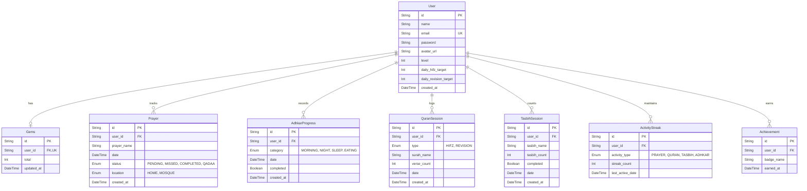

# Noor 🌙 — Islamic Tracking & Gamification App

Noor is a gamified Islamic tracking application designed to engage young Muslims (ages 6–14) in building consistent spiritual habits. By combining essential daily practices with interactive gamification elements, Noor helps users track their prayers, Quran memorization, Adhkar, and Tasbih, rewarding them with Gems, Streaks, Levels, and Badges.

---

## 📂 Project Structure

This monorepo is organized into two primary applications:

```text
Noor/
├── client/          # Frontend Web App (React/Vite/Next.js setup in progress)
└── server/          # Backend REST API (Node.js, Express, Prisma, PostgreSQL)
```

---

## 🚀 Core Features

### 1. Daily Prayer Tracker 🕋
*   Track the five daily prayers: **Fajr, Dhuhr, Asr, Maghrib, and Isha**.
*   Select prayer locations (Mosque, Home, or Congregation) to receive dynamic Gem rewards.
*   Earn an **On-Time Bonus** (+5 Gems) for completing prayers promptly.

### 2. Quran Memorization & Revision 📖
*   Log individual sessions for Hifz (memorization) and Revision.
*   Earn points per Ayah (e.g., +2 Gems for Hifz, +1 Gem for Revision).
*   Configurable daily verse targets (e.g., target 5 verses of Hifz or 15 verses of Revision) with extra **Goal Bonuses** upon completion.

### 3. Interactive Dhikr & Tasbih Counter 📿
*   Electronic counter for daily Tasbih (Subhan Allah, Alhamdulillah, Allahu Akbar).
*   Dynamic visual feedback for completion (e.g., target of 33 per phrase).
*   Gems awarded upon completed sessions and milestone counts.

### 4. Adhkar Checklists 🌅
*   Track progress across distinct daily categories: **Morning (أذكار الصباح), Evening (أذكار المساء), and Sleep (أذكار النوم)**.
*   Clean category-specific checklists that refresh daily.

### 5. Gamification Engine 💎
*   **Gems Wallet:** Keeps track of lifetime and current active gems.
*   **Leveling System:** Users automatically level up for every 500 Gems earned, prompting celebratory milestones in the UI.
*   **Activity Streaks:** Tracks consecutive active days independently for Prayers, Quran, Tasbih, and Adhkar.
*   **Streaks Bonuses:** Extra +50 Gems for 7-day streaks, and +200 Gems for 30-day streaks.
*   **Achievements & Badges:** Unlock rare badges such as **Fajr Knight (فارس الفجر)** (7 consecutive Fajr prayers) or **Hero of the Week (بطل الأسبوع)** (all 35 prayers completed in a week).

---

## 🛠 Tech Stack

### Backend (`server/`)
*   **Runtime:** Node.js (ES Modules syntax)
*   **Framework:** Express.js
*   **Real-time Communication:** Socket.io
*   **Database ORM:** Prisma
*   **Database:** PostgreSQL (with Prisma Accelerate integration)
*   **Validation:** Joi
*   **Logging:** Winston Logger
*   **Security & Authentication:** JWT cookies (HttpOnly, SameSite=Strict), bcryptjs password hashing, and CORS protection.

### Frontend (`client/`)
*   *In progress* (designed to connect to the `/api/v1` backend endpoints with real-time websocket updates).

---

## 📊 Database Relationship Schema



---

## 🛡 Security & Design Principles

1.  **HttpOnly JWT Cookies:** Authentication relies on JSON Web Tokens signed by the server and stored in secure, `HttpOnly` and `SameSite=Strict` cookies. This mitigates Cross-Site Scripting (XSS) and simplifies token rotation.
2.  **Request Validation:** All incoming request payloads are parsed and validated using `Joi` schemas before database actions are executed, maintaining high database integrity.
3.  **Atomic Transactions:** Gem allocation, streak updates, and achievement checks run inside safe database transactions to prevent race conditions or point duplication.
4.  **Real-Time Alerts:** Equipped with Socket.io to push real-time level ups, achievements, and rewards down to the frontend user immediately.

---

## ⚡ Quick Start

### 1. Clone & Setup Environments

Navigate to the `server/` directory and configure the environment:

```bash
cd server
cp .env.example .env  # Or create a .env file directly
```

Make sure your `.env` contains:
```env
PORT=8000
NODE_ENV=development
DATABASE_URL="postgresql://<username>:<password>@<host>:<port>/<db>?sslmode=require"
DIRECT_URL="postgresql://<username>:<password>@<host>:<port>/<db>?sslmode=require"
JWT_SECRET="YOUR_SECURE_JWT_SECRET"
```

### 2. Install Dependencies

```bash
npm install
```

### 3. Run Database Migrations

Generate the Prisma Client and sync the schema with your database:

```bash
npx prisma db push
npx prisma generate
```

### 4. Start the Application

Start the development server with hot-reloading:

```bash
npm run dev
```

---

## 🔗 Documentation Links

*   For a complete list of endpoints, validation payloads, and response objects, see [Server README](./server/README.md).
*   For the complete product logic and detailed specification of the gamification rewards, see [Noor Backend Documentation](./server/Noor_Backend_Documentation.md).
